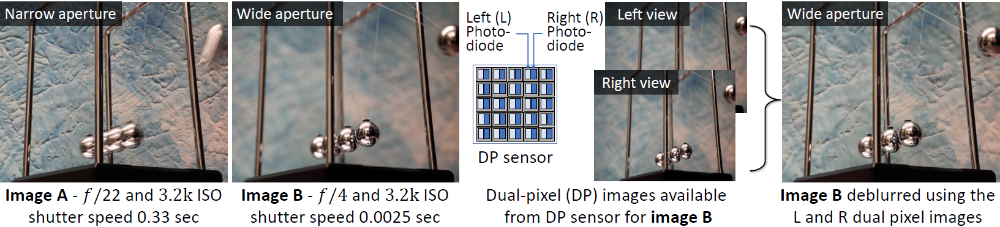

# Defocus Deblurring Using Dual-Pixel Data

*[Abdullah Abuolaim](http://www.eecs.yorku.ca/~abuolaim/)*<sup>1</sup>
and *[Michael S. Brown](http://www.eecs.yorku.ca/~mbrown/)*<sup>1,2</sup>

<sup>1</sup>York University, Toronto, Canada &nbsp;&nbsp; &nbsp; <sup>2</sup>Samsung AI Center, Toronto, Canada



Reference github repository for the paper [Defocus Deblurring Using Dual-Pixel Data](https://arxiv.org/pdf/2005.00305.pdf). Abdullah Abuolaim and Michael S. Brown, arXiv preprint arXiv: 2005.00305, 2020. If you use our dataset or code, please cite our paper:
```
@article{abuolaim2020defocus,
  title={Defocus Deblurring Using Dual-Pixel Data},
  author={Abuolaim, Abdullah and Brown, Michael S},
  journal={arXiv preprint arXiv: 2005.00305},
  year={2020}
}
```

### Dataset and Code:
The dataset, code, and trained models will be available soon.
