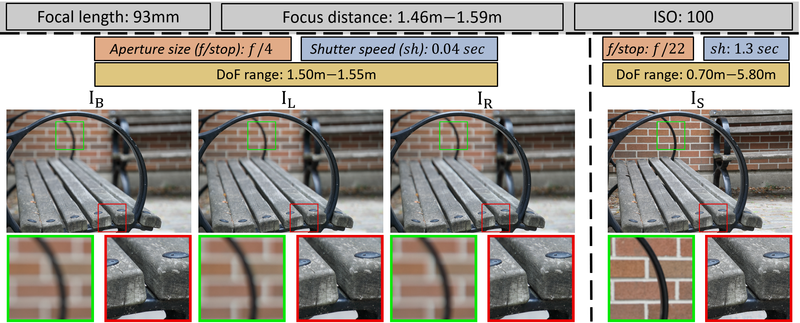
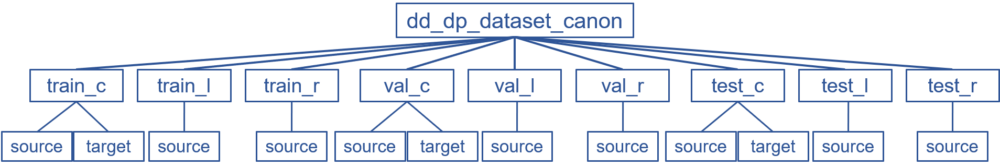

# [Defocus Deblurring Using Dual-Pixel Data](https://www.eecs.yorku.ca/~abuolaim/eccv_2020_dp_defocus_deblurring/)

*[Abdullah Abuolaim](http://www.eecs.yorku.ca/~abuolaim/)*<sup>1</sup>
and *[Michael S. Brown](http://www.eecs.yorku.ca/~mbrown/)*<sup>1,2</sup>

<sup>1</sup>York University, Toronto, Canada &nbsp;&nbsp; &nbsp; <sup>2</sup>Samsung AI Center, Toronto, Canada


Reference github repository for the paper [Defocus Deblurring Using Dual-Pixel Data](https://www.eecs.yorku.ca/~abuolaim/eccv_2020_dp_defocus_deblurring/defocus_deblurring_eccv_2020.pdf). Abdullah Abuolaim and Michael S. Brown, Proceedings of the European Conference on Computer Vision (ECCV), 2020. If you use our dataset or code, please cite our paper:
```
@article{abuolaim2020defocus,
  title={Defocus Deblurring Using Dual-Pixel Data},
  author={Abuolaim, Abdullah and Brown, Michael S},
  booktitle={Proceedings of the European Conference on Computer Vision (ECCV)},
  year={2020}
}
```

## Dataset
Dual-Pixel Defocus Deblurring (DPDD) dataset contains 500 carefully captured scenes.
This dataset consists of 2000 images i.e., 500 DoF blurred images with their 1000 dual-pixel (DP) sub-aperture views and 500 corresponding all-in-focus images all at full-frame resolution (i.e., 6720x4480 pixels).



* Images captured by Canon EOS 5D Mark IV DSLR camera

    * [Indoor CR2 RAW images](https://ln2.sync.com/dl/fcb7bc330/4nab2s9c-puqhvr85-ap6zrkwd-azjk93j4)

    * [Outdoor CR2 RAW images](https://ln2.sync.com/dl/ef0e31350/9byubsyf-8e3ggemz-fcgij3sa-udpwjm3r)

    * [All images used for training/testing](https://ln2.sync.com/dl/c45358c50/r7kpybwk-xw8hhszh-qkj249ap-y8k2344d) (processed to an sRGB and encoded with a lossless 16-bit depth)
	
	
* Images captured by Google Pixel 4 smartphone camera

    * [Pixel 4 images used for testing in our experiments](https://ln2.sync.com/dl/ec54aa480/b28q2xma-9xa3w5tx-ss2cv7dg-2yx935qs)
	* We refer redears to this [GitHub repository](https://github.com/google-research/google-research/tree/master/dual_pixels) created by Google research in order to extract DP views for Pixel smartphone
    * Recall, the smartphone camera currently has limitations that make it challenging to train our DPDNet with
		* The Google Pixel smartphone cameras do not have adjustable apertures, so we are unable to capture corresponding sharp images using a small aperture
		* The data currently available from the Pixel smartphones are not full-frame, but are limited to only one of the Green channels in the raw-Bayer frame


* Extracting DP left and right views from the RAW CR2
    * Download [Digital Photo Professional](https://www.canon.ca/en/product?name=Digital_Photo_Professional_Express&category=/en/products/Software-Solutions/Camera---Camcorder-Apps) CANON software
    * Save the DP views in high-quality 16-bit TIF images as follows
	


* Training, validation, and testing sets
    * The dataset is divided randomly into:
		* 70% training, 15% validation, and 15% testing
	* Each set has a balanced number of indoor/outdoor scenes
    * The image names for each set can be found in `./DPDNet/file_names/` directory
	
* The dataset is organized based on the following directory structure



    $dir_name$_c: directory of the final output combined images
	$dir_name$_l: directory of the corresponding DP left view images
	$dir_name$_r: directory of the corresponding DP right view images
	source: images exhibiting defocus blur
	target: the corresponding all-in-focus images

## Code
### Prerequisites
* The code tested with:
	* Python 3.6.9
	* TensorFlow 1.9.0
	* Keras 2.2.4
	* Numpy 1.17.2
	* Scikit-image 0.16.2
	* OpenCV 3.4.2
	
*Despite not tested, the code may work with library versions other than the specified*

### Installation
Clone with HTTPS this project to your local machine 

```bash
git clone https://github.com/Abdullah-Abuolaim/defocus-deblurring-dual-pixel.git
cd defocus-deblurring-dual-pixel
```

### Evaluation Metrics
Results are reported on traditional signal processing metrics i.e., MSE, PSNR, SSIM, and MAE. Implementation can be found in `./DPDNet/metrics.py`.
We also incorporate the recent learned perceptual image patch similarity (LPIPS) proposed by `R. Zhang et al.` [1].  Implementation can be found in this [GitHub repository](https://github.com/richzhang/PerceptualSimilarity)

### Testing
* Download [pretrained model](https://ln2.sync.com/dl/bb3c2bf90/i9dgr6qt-m4msfc3m-9rzx7m96-92v8pw2h) `defocus_deblurring_dp_l5_s512_f0.7_d0.4.hdf5` inside `./DPDNet/ModelCheckpoints/`

* Canon dataset
	* Download [dataset](https://ln2.sync.com/dl/c45358c50/r7kpybwk-xw8hhszh-qkj249ap-y8k2344d) `dd_dp_dataset_canon.zip` and unzip it inside `./DPDNet/`
	* Recall that we test with 16-bit images (`bit_depth=16` in `./DPDNet/config.py`)
	* Run:

		```bash
		python ./DPDNet/main.py
		```
		
* Pixel 4 test images
	* Download [dataset](https://ln2.sync.com/dl/ec54aa480/b28q2xma-9xa3w5tx-ss2cv7dg-2yx935qs) `dd_dp_dataset_pixel.zip` and unzip it inside `./DPDNet/`
	* Change the dataset name variable inside `./DPDNet/config.py` to be `dataset_name='_pixel'`
	* Recall that we test with 16-bit images (`bit_depth=16` in `./DPDNet/config.py`)
	* Run:

		```bash
		python ./DPDNet/main.py
		```
		
### Training
* Pre-processe data to extract patches for training
	* As we mentioned in the main paper, we discard 30% of the patches that have the lowest sharpness energy
	* We found it faster to prepare training patches beforehand instead of extract patches during the runtime
	* Download [dataset](https://ln2.sync.com/dl/c45358c50/r7kpybwk-xw8hhszh-qkj249ap-y8k2344d) `dd_dp_dataset_canon.zip` and unzip it inside `./DPDNet/`
	* The patch size, overlapping ratio, and sharpness energy filtering ratio are set as described in the main paper
	* Run:

		```bash
		python ./DPDNet/image_to_patch_filter.py
		```
	
	* Running above creates a new directory `dd_dp_dataset_canon_patch` that has the training/validation patches

* Start training based on the procedure and hyper-parameters described in the main paper
	* `./DPDNet/config.py` module contains all the configurations and hyper-parameters
	* Change `op_phase='test'` to `op_phase='train'` in `./DPDNet/config.py`
	* Recall that we train with 16-bit images (`bit_depth=16` in `./DPDNet/config.py`)
	* Run:

		```bash
		python ./DPDNet/main.py
		```
## Contact

Should you have any question/suggestion, please feel free to reach out:

[Abdullah Abuolaim](http://www.eecs.yorku.ca/~abuolaim/) (abuolaim@eecs.yorku.ca)

## Related Links
* [Project page](https://www.eecs.yorku.ca/~abuolaim/eccv_2020_dp_defocus_deblurring/)
* [ECCV'20 camera-ready paper](https://www.eecs.yorku.ca/~abuolaim/eccv_2020_dp_defocus_deblurring/defocus_deblurring_eccv_2020.pdf)
* [ECCV'20 camera-ready supplemental material](https://drive.google.com/file/d/1ANQOil6VjOhEDfzxu1Z1H5ZdjpkR4KqJ/view?usp=sharing)
* [Project page for our ECCV'18 paper "Revisiting Autofocus for Smartphone Cameras"](https://www.eecs.yorku.ca/~abuolaim/eccv_2018_autofocus/)
* [Project page for our WACV'20 paper "Online Lens Motion Smoothing for Video Autofocus"](https://www.eecs.yorku.ca/~abuolaim/wacv_2020_autofocus_lens_motion/)
* [GitHub page for our ICCP'20 paper "Revisiting Autofocus for Smartphone Cameras"](https://github.com/abhijithpunnappurath/dual-pixel-defocus-disparity)
* [GitHub page for our arXiv'20 paper "Learning to Reduce Defocus Blur by Realistically Modeling Dual-Pixel Data"](https://github.com/Abdullah-Abuolaim/recurrent-defocus-deblurring-synth-dual-pixel)

## Reference
[1] `R. Zhang et al.` R. Zhang, P. Isola, A. A. Efros, E. Shechtman, and O. Wang. *The unreasonable effectiveness of deep features as a perceptual metric.* In CVPR, 2018.